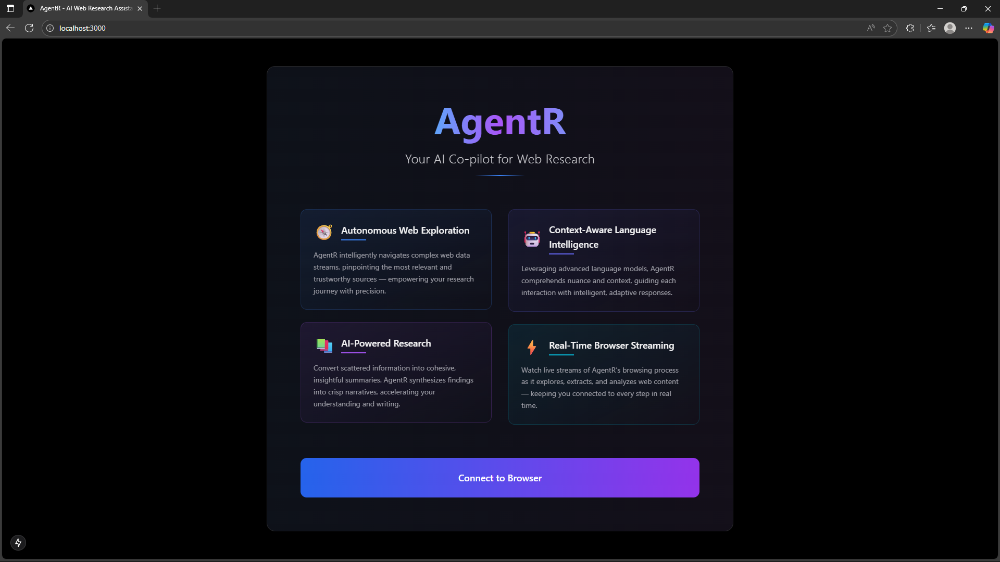
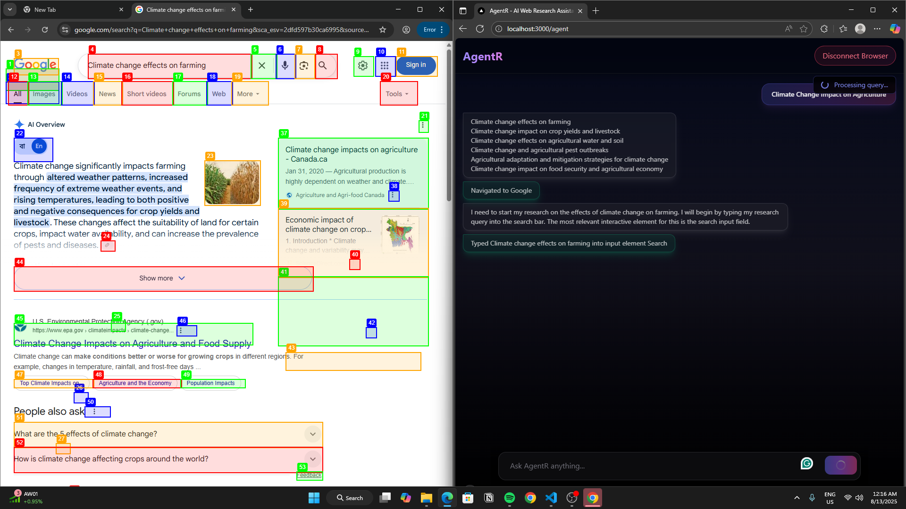

# AgentR 🤖



An intelligent, autonomous browser-based research agent that performs multi-step web-based academic research, extracts and summarizes information, cites sources, and generates full articles—all automatically.

---

## 🚀 Features

- **Autonomous Web Research**: Navigate websites, follow links, and extract academic information automatically.  
- **Multi-step Reasoning**: Capable of handling complex, multi-step tasks.  
- **Citation Generation**: Automatically generates citations for all sources.  
- **Article Writing**: Produces structured summaries and full articles.  
- **Stuck Detection**: Detects dead-ends and reroutes the agent for optimal research.  
- **Open-Source Stack**: Built with [LangGraph](https://www.langgraph.com/), [Playwright](https://playwright.dev/), [LangChain](https://www.langchain.com/), [Gemini](https://www.gemini.com/) LLM, and [Chroma](https://www.trychroma.com/).

---

## 🎬 Demo

### Video Demonstration

[.mp4)]


---

## 🛠️ Installation

### Backend Setup

1. Clone the repository
   ```bash
   git clone https://github.com/Shahrukhzx/AgentR.git
   cd AgentR
   cd backend
   ```

2. Install Python dependencies:

   ```bash
   pip install -r requirements.txt
   ```


3. Set up environment variables in `.env`:
   ```bash
   GEMINI_API_KEY= "your_gemini_api_key"
   ```

4. Run the backend:

   Make sure you are in the backend folder

    ```bash
    uvicorn app.main:app --reload --port 8000 
    ```

   For Windows User:

    ```bash
    uvicorn app.main:app --port 8000
    ```

8. Access the API at `http://localhost:8000`

### Frontend Setup

1. Open a new terminal and make sure you are in the AgentR folder:
   ```bash
   cd frontend
   ```

2. Install dependencies:
   ```bash
   npm install
   ```

3. Run the frontend:
   ```bash
   npm run dev
   ```

4. Access the frontend at `http://localhost:3000`

---

## 📜 License

MIT License – see [LICENSE](LICENSE) for details.

---

## 🙏 Acknowledgements

- [LangGraph](https://www.langgraph.com/) – Agent orchestration  
- [Playwright](https://playwright.dev/) – Browser automation  
- [LangChain](https://www.langchain.com/) – LLM integration  
- [Chroma](https://www.trychroma.com/) – Vector storage  

---

## 📸 Screenshots

